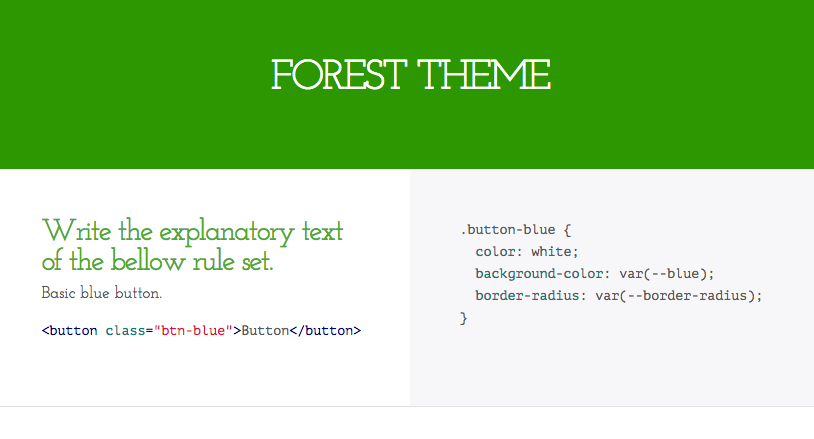

# psg-theme-forest [](https://travis-ci.org/morishitter/psg-theme-forest)

'Forest': Theme of postcss-style-guide

## Install

```shell
$ npm install psg-theme-forest
```

## Theme



## License

The MIT License (MIT)

Copyright (c) 2015 Masaaki Morishita
